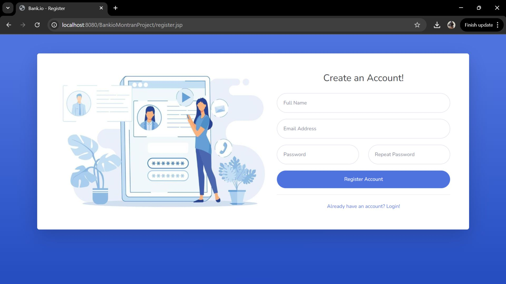
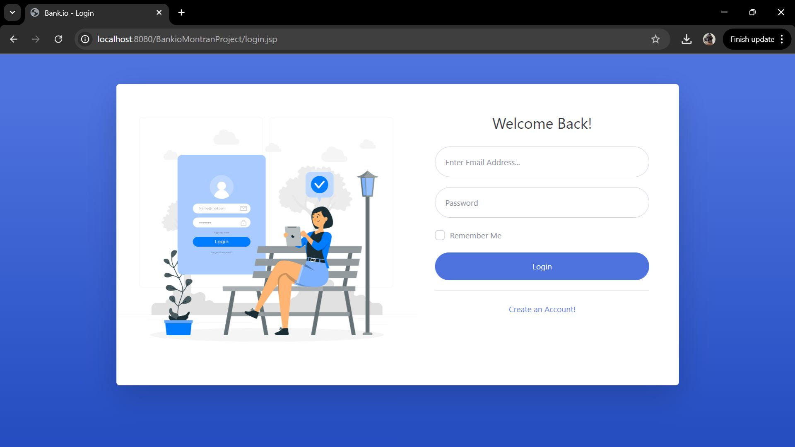
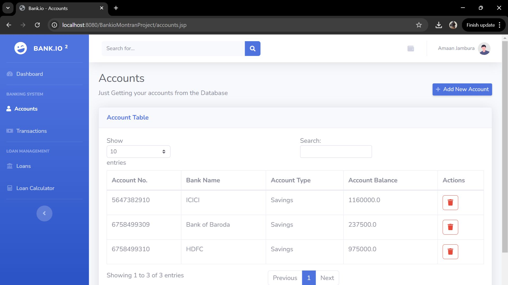
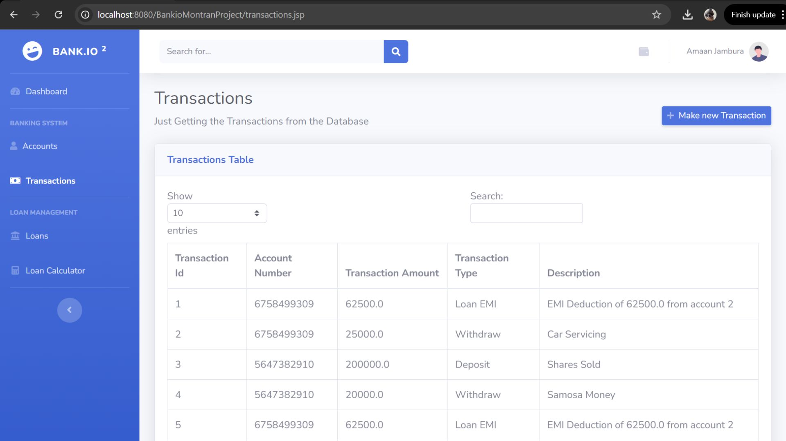
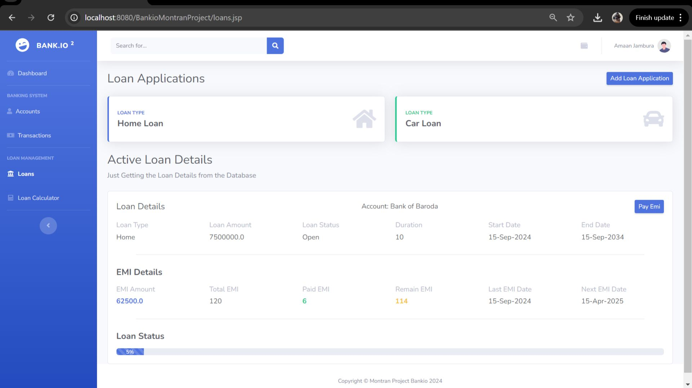
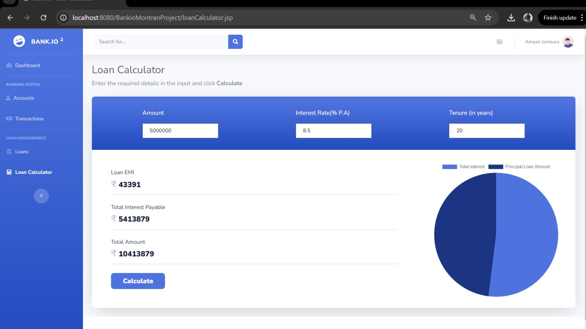

# **Bank.io** 🏦💻

**Bank.io** is an **open-source banking web application framework** that combines **secure backend architecture** with **dynamic, user-friendly frontend components**. Designed for developers, it provides a **solid foundation** for building **scalable, maintainable financial systems** with **rich data visualization** and **seamless transaction management**.

---

## **Why Bank.io?** 🤔✨

This project aims to **streamline the development of banking applications** by offering a **modular, extendable architecture**. The core features include:

### **1. Database Integration** 🗄️
- Utilizes **Hibernate ORM** for **reliable, efficient data persistence** across customers, accounts, transactions, and loans.

### **2. Secure User Sessions** 🔒
- Implements **robust login, registration, and session management** for a **seamless user experience**.

### **3. Interactive Dashboards** 📊
- Leverages **Chart.js** and **DataTables** for **engaging financial visualizations** and **data analysis**.

### **4. Transaction & Account Management** 💳
- Supports **adding, updating, and deleting accounts and transactions** with **real-time updates**.

### **5. Loan Processing** 💰
- Includes tools for **loan application, calculation, and EMI payments**, enhancing **financial planning features**.

### **6. Modular Architecture** 🏗️
- Clear separation of concerns with **DAO layer, servlets, and models** for **easy customization and extension**.

---
## **Output Looks Like** ✨

